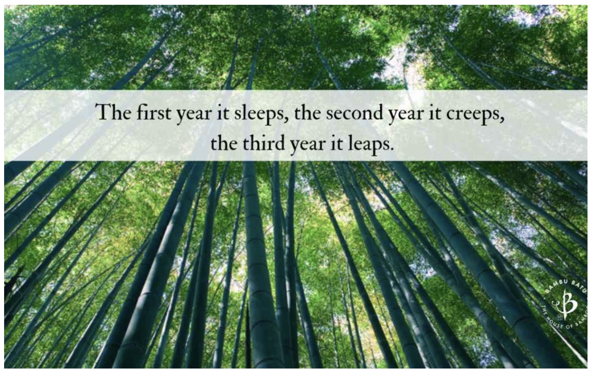

# 4 Most Important Topics

**Background: I self-learned programming\(elementary level\) and went to a 5-month full-time coding boot camp before I got a software engineer job. I do not have a CS degree.** 

According to my personal experience, by purely picking up a modern web framework \(eg MERN stack\) and a few core development languages \(eg JavaScript and Python\), I could actually start working and contributing to a development project. 

But since I have a great passion for this industry and always curious about how things work, I do spend a lot of effort investigating what is happening behind the scene that makes things work. Apart from curiosity, since my long-term career goal is to be a Solution Architect \(a developer as a tech lead \(Not PM, QA, business analyst, etc\)\),  CS foundation knowledge is very important and I hope to pick up what a typical CS graduate should know. I don't just want to be a CRUD coding monkey.

I once considered to get a CS master's degree, but I am quite tired of regular schooling \(you know sometimes schooling sucks and could be boring and slow\) and wanted to get some industry experiences first so I decided to work for some while and see if getting a master's degree is really necessary for me \(or if I am going to get one, what field in CS should be my focus\). Thus, during the last two years since I started working, I decided to utilize my leisure time to self-learn a CS \(Bachelor's\) degree course content to make myself LESS ignorant.

### Here is what I did to extract what I should learn in case you are curious:

1\) Go through Universities' CS Bachelor's degree course lists  \(from world-famous universities like Standford, MIT, Tsinghua, to normal ones\). I guess it is the most authorized source of information.

2\) Ask the programmers and tech leads around me \(for example, my colleagues who graduated with a CS degree\).

3\) Forums' information.

### After having the list, I prioritized the fields of knowledge and learn them one by one to fill my CS knowledge gap. 

Although it is always better to know more than less, time is a limited resource. I hereby extracted the 4 Most Important Theoretical CS Topics for people with backgrounds similar to mine. Of course, you are encouraged to have your own learning plans. It is just a reference in case you don't have time to do the research. **Anyway, the core message is: After building up the most core foundation, learning other advanced topics would be much easier.** 

### Why?

_**Spending time on CS foundation knowledge might seem like a waste of time because it is a time-consuming long journey and it focuses on the theoretical side which probably could not help you do CRUD quicker. However, in the long term, it gives you the power to understand the most intrinsic things, and thus you could know how to really utilize the power of computers to do great things. Especially if you want to be a programmer for a very long time.**_

_\*\*\*\*_

**Bamboo** _****_🎋🎋🎋 is one of the most admirable plants in Chinese culture. It is giantly tall and flexible. In the first few years when bamboo is still a baby, bamboo doesn't seem to grow much, it remains similar height. But actually, it is spending its effort growing its root downwards as deep as possible. One day after a few years, when everything is ready, it starts to surge and grow upwards rapidly. It could grow impressively tall and form a feast for the eyes. It is because of its solid foundation, which it spent years of effort building.

