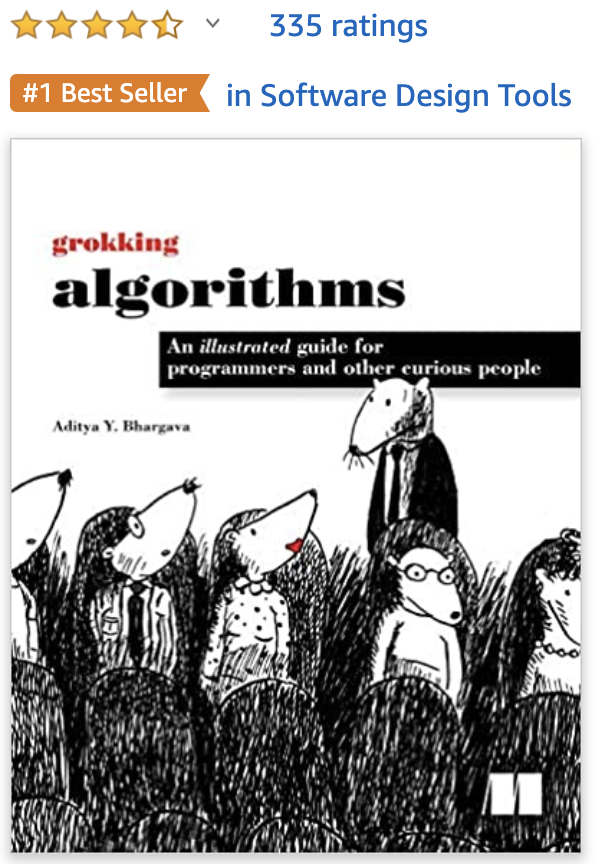
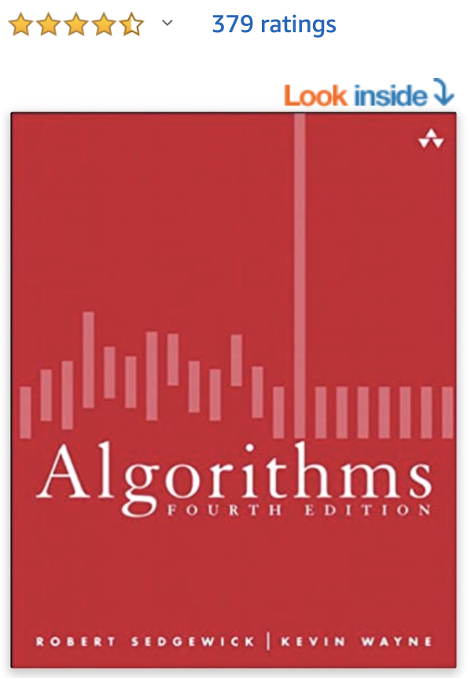
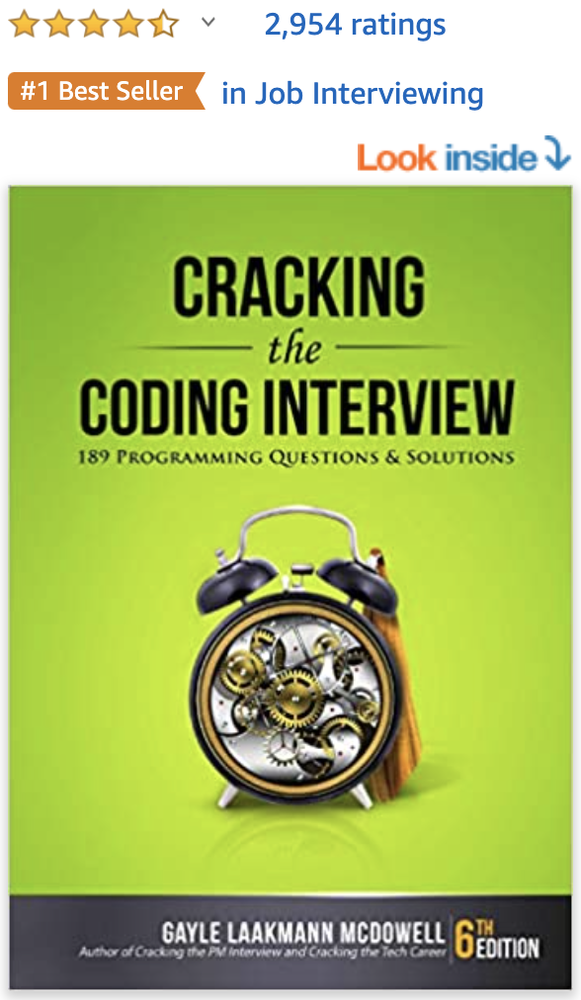

# Algorithms & Data Structures

I like this part of computer science. I like it as a hobby.

will add more content...

## \[Language choice\]

To practice algorithms and data structures, you have to be proficient in a programming language. Common ones are Python, C++, Java, JavaScript, C, etc.

You can just choose the one you are most comfortable with. Language is just a tool to learn algorithms. However, remember to choose a more popular one that has a huge community so that you can find answers to your problems easier. 

### \[I chose Java\]

Personally, I use Python and JavaScript the most in my projects but I chose to learn algorithms in Java. I am actually not very familiar with Java since I seldom use it in my projects and Java is quite a different language from Python and JavaScript \(for more details, please refer to section "Programming Languages" under "MINI COURSES". 

#### There are a few reasons why I chose Java:

**1\)** I want to learn an Object-oriented programming language and Java is one of the most popular ones. C++ is also a good one. However, C++ is much more complicated and you also need to deal with the issues of pointers. I don't think it is a good choice for practicing Algorithms if you are a beginner or you seldom\(or never\) use C++ in your workplace.

**2\)** Java is a super popular language to use for backend development because of its robustness. Java's Spring stack is basically the most commonly used tech stack for building the backend of enterprise-level applications. I picked up Java as a door to explore a bigger backend world.

**3\)** A lot of famous algorithm books and resources are written in Java. It saves me a lot of time looking for information and code demo.

**4\)** Java is commonly used in interviews. Java is a secured language in coding interviews because most companies have interviewers who know Java.

**=&gt; Everyone's situation is different. You may have your own answer**. Apart from Java, Python is gaining popularity as a language for learning algorithms because the syntax is so precise. Using Python can be an advantage in coding interviews, especially if you need to write code on a whiteboard by your hands. If I didn't choose Java, I will choose Python. And of course, if you have time, you can absolutely practice algorithms in multiple languages. This is good for knowing a language in-depth.

## \[Resources and learning path\]

### NOT for readers who aim for ACM competitions 👉👈

### 1\) \[Book for the foundation\] Grokking Algorithms: An illustrated guide for programmers and other curious people [\(1st Edition\)](https://amzn.to/36He5fY)

### 2\) \[Book for the foundation\] Algorithms [\(4th Edition\)](https://amzn.to/2SAzxL2)

#### This book is the reference book of the following two courses by Princeton University. You can also go through them if you don't like reading books solely.





### 3\) \[Book for Interviews\] Cracking the Coding Interview: 189 Programming Questions and Solutions [\(6th Edition\)](https://amzn.to/3np5apd)

### 

### 4\) \[Playground for writing code\] Leetcode 

#### Where I practice writing algorithms and data structures.



