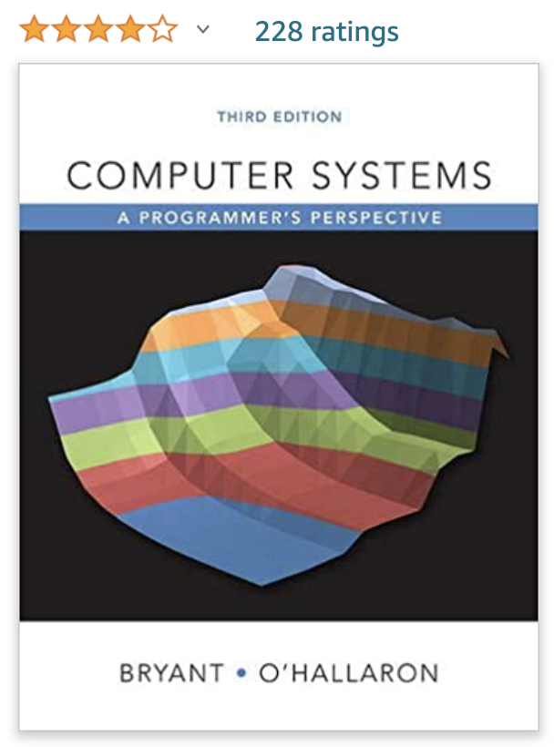

# Computer Formation

will add more content...

## \[Resources\]

### 1\)  \[Youtube channel\] Crash Course Computer Science Preview



### 2\) \(Chinese\) \[2019 王道考研 计算机组成原理\]

The most popular online revision course for "The Computer Composition" university exam \(master degree entrance exam\) in mainland China.



### 3\) \[Classic University Book\] CSAPP

### Computer Systems: A Programmer's Perspective [3rd Edition](https://amzn.to/2GShCxg)

