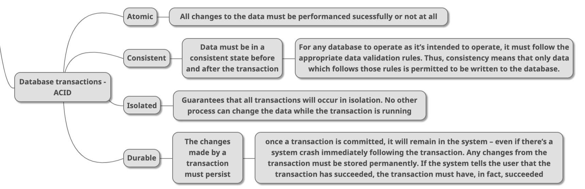

# Database Systems

will add more content...

## \[Resources\]

### 1\) \[University course by CMU\]  \(English\) database system in general

#### CMU's 15-445/645 Intro to Database Systems \(Fall 2019\) by Prof. Andy Pavlo



### 

### 

### 2\) \(In Chinese\)  \[Column focusing on advanced MySQL and the mechanism behind MySQL\]



