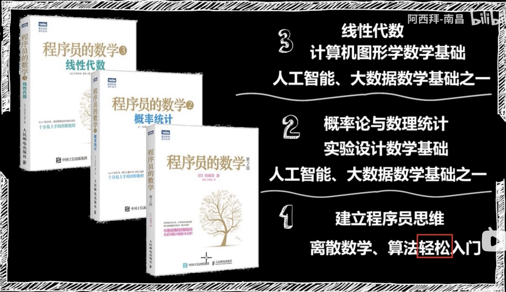

# Programmers' Mathematics

will add more content...

## \[Resources\]

### 1\) \[Maths for Programmers Tutorial - Full Course on Sets and Logic\] 



### 2\) \(Chinese\) \[Introduction to 3 popular programmer's Math books\]



