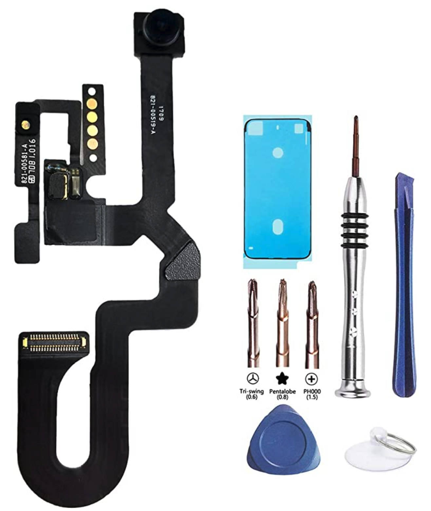

# Fixing my own iPhone camera

## \[Reasons for fixing it myself\]

The front camera of my iPhone was broken recently. The front camera could still be turned on but it took horrible green blurred pictures that turned pretty ladies into daunting green creatures_🤢🤢🤢_. I had to handle this problem.

However, I did not want to spend 2-3000 HKD in Apple and have my phone kept there for a week. 

I also did not want to hand in my phone to random little shops. Some of them offered a reasonable price and you can get your iPhone in an hour.  But after researching online, I found that there is a risk that your iPhone gadget would be stolen or changed away.

Since it is a relatively old iPhone, I was thinking of buying a new one originally. So an idea came to my mind, **why don't I just fix it MYSELF**? Also, I am a developer and somehow a Geek, I always hope to see what is inside my iPhone so it would be the perfect time to do so. If it failed, then I go to buy a new one.

## \[How did I do so\]

#### \[1 Buy the part \(Apple original \(in Chinese, 原裝拆機\)\) \]

Then I searched on amazon, a quality original Apple front camera part from a popular store is really cheap and only took below 200 HKD including tools and shipping costs. I immediately ordered one since the cost is low.

[https://amzn.to/3nrSOgb](https://amzn.to/3nrSOgb)

#### 

#### \[2 Follow a clear tutorial\]



So with the new Apple frontend camera part, a set of tools, a tutorial video, and a courageous heart, I started the journey.

#### 

#### \[3 Succeeded\]

It was supposed to finish in 15 minutes. I took 45 minutes to make it. It needed a certain level of your hands' flexibility but glad that I succeeded. Maybe one day if I got unemployed, apart from being a Uber driver, I can also repair iPhone.😹😹😹 Joking.

## \[Tips\]

#### \[Screws\]

Since the screws are tiny, remember to keep the screws in a safe and stable place so you won't lose it PLUS place them in an order that you could know "which one to put back to which hole" when you are assembling back your iPhone.

#### \[Water-resistant\] 

If your iPhone is a water-resistant version, remember to choose a gadget package that includes the above water-resistant plastic \(or buy it separately\). It is used to stick to the edges of your iPhone when you finish changing the camera and ready to resemble back the phone. 

I was actually pretty amazed by how simple the technique Apple adopts to make an iPhone water-resistant😹😹😹.

## \[Caution\]

The most secure and legitimate way to fix your iPhone is by always paying Apple. I have a legitimate reason for not choosing Apple. For example, it is an old iPhone so the failing cost is relatively low plus I was curious to inspect my iPhone's composition. 

But in your case, maybe paying Apple is the best solution \(e.g your iPhone is still protected by Apple care\). Apple might know if you had your iPhone repaired in a non-Apple place so not repairing your iPhone in Apple may subject to higher repair costs or Apple may reject to repair it in the future.

#### Good Luck. May the odds be ever in your favor [🏹](https://emojipedia.org/bow-and-arrow/#:~:text=Emoji%20Meaning,to%20Emoji%201.0%20in%202015.)[🏹](https://emojipedia.org/bow-and-arrow/#:~:text=Emoji%20Meaning,to%20Emoji%201.0%20in%202015.)[🏹](https://emojipedia.org/bow-and-arrow/#:~:text=Emoji%20Meaning,to%20Emoji%201.0%20in%202015.)

 

