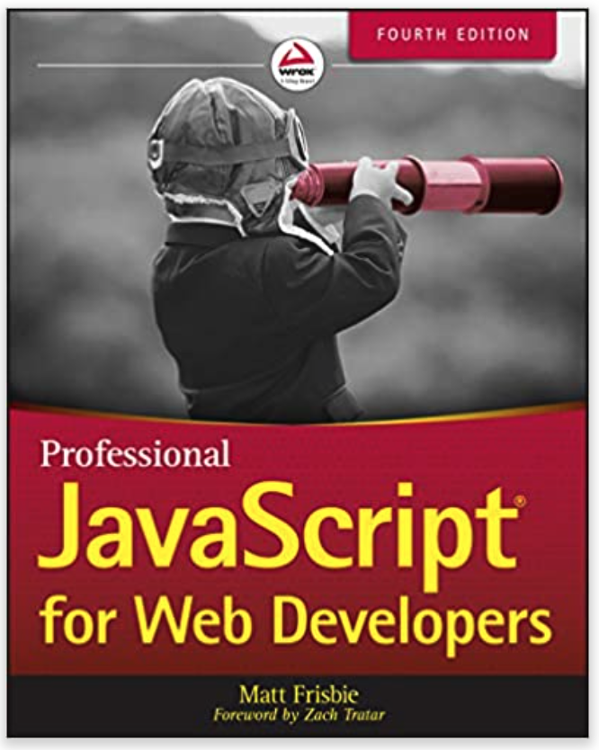

# Frontend

## Recommended resources:

#### 1\) Udemy video course: The Complete Web Developer in 2020: Zero to Mastery



#### 2\) Book: Professional JavaScript for Web Developers \(4th Edition\)

[https://www.amazon.com/Professional-JavaScript-Developers-Matt-Frisbie/dp/1119366445](https://www.amazon.com/Professional-JavaScript-Developers-Matt-Frisbie/dp/1119366445)

