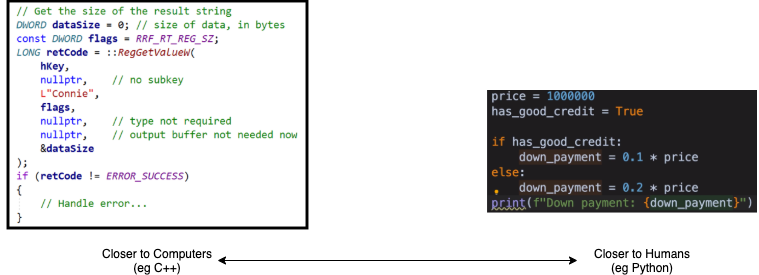
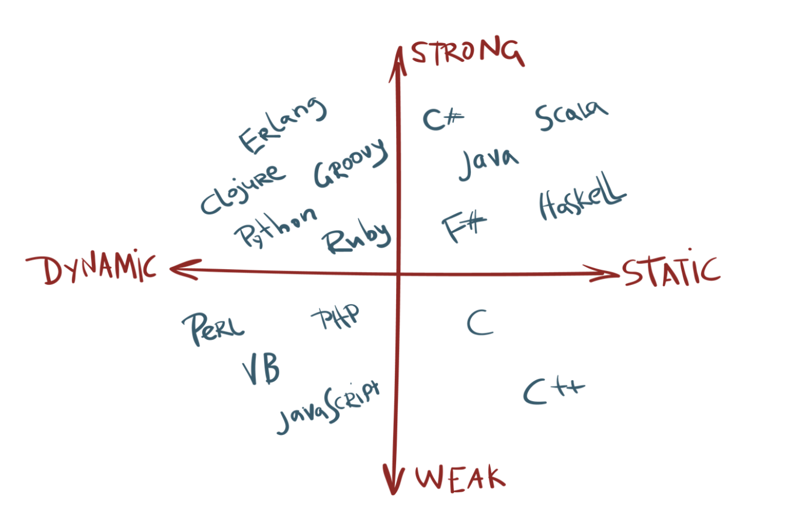
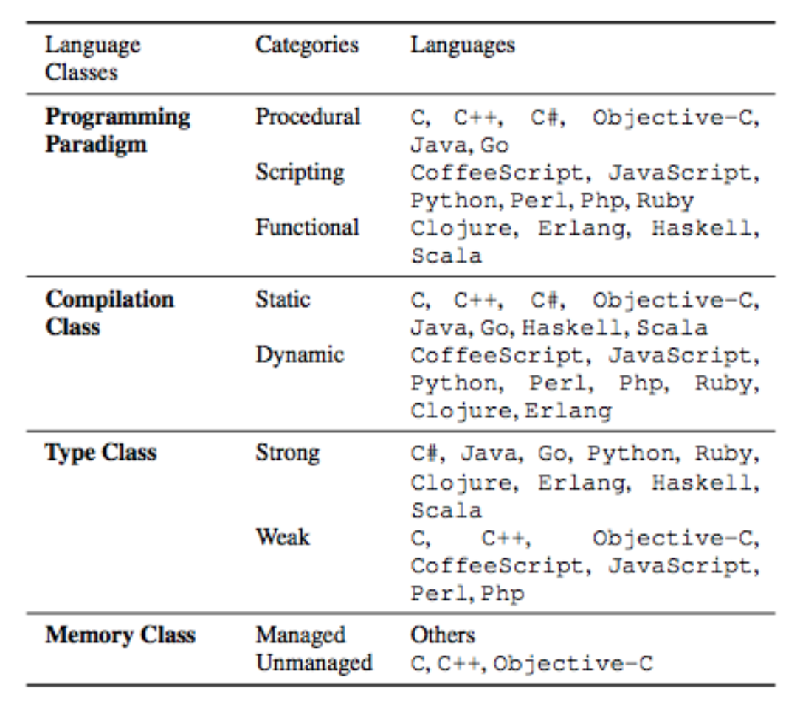

# Programming Languages

#### When I started learning different programming languages, I thought of a question: 

### **Why there are many programming languages out there? Is it possible to unify them all into just one programming language?** 

This question is quite complicated but in short, I think the answer is it is hard and unnecessary in the current era \(not sure in the future. Maybe one day in the future, supercomputers appear and thus computation power is no longer an issue worth concerning. But at least in the current era\): different programming languages serve different purposes, and some conflicts exist between fulfilling one requirement versus another so they have to separate into different languages. 

### We can view this question in a few perspectives:

### 1\) Closer to machine\(i.e. computers\) VS Closer to human \(Related CS foundation knowledge: Complier and computer system\)

The way computers understand commands is different from humans. Computers understand commands in bits \(ie combinations of 0 and 1\) while humans use human languages like English. 

Closer to one end means further from the other end:

**Why does it matter?** Because it actually implies a battle between a program's running speed vs its human readability. 

**\[Closer to machine\]** means the language is rawer \(looking uglier to humans\) and needs humans to do more manual configurations\(eg handle pointers for memory management\) to suit the computer. It provides more autonomy for programmers to control the computer. It needs less time to be translated into those 0 and 1 so the programs generally run a lot faster \(eg C can run 300 times faster than Python in some extreme cases\). 

**\[Closer to human\]** means more readable and handy to humans but needs more extra power to be translated \(deeper knowledge of \[how the "translation" works\] is related to cs foundation knowledge "Complier" and how computers understand commands\) into machine code \(0 and 1\).

Some programming languages like C++ is closer to the Machine but harder for a human to write and understand. So they are more suitable for writing low latency programs like high-frequency trading programs when speed is the highest concern. 

Some programming languages like Python is easier for a Human to understand and pick up. Some of them like Python and Javascript don't even need you to understand deeper CS knowledge like memory management, pointers, and garbage collection, and you can still use it smoothly. It is more suitable for commercial usages like making a normal book store application \(easier to learn so are more flexible for software development teams to pick up and start developing right away\) or for non-hardcore programmers like biology scientists and business analysts to do data analysis. A lot of complicated computer science concepts are actually encapsulated so the programmers can just focus on their usage.

### 2\) Types of Programming Languages

Here is a broad introductive view of how to understand a programming language.

To understand a programming language, you can start by knowing what type it is.

**There are mainly 2 pairs of keywords :**

* **Dynamic VS Static**
* **Strong VS Weak**

The above graph from this blog [https://android.jlelse.eu/magic-lies-here-statically-typed-vs-dynamically-typed-languages-d151c7f95e2b](https://android.jlelse.eu/magic-lies-here-statically-typed-vs-dynamically-typed-languages-d151c7f95e2b) , has categorized different programming languages into 4 categories. This blog pretty much explained the concepts.

Understanding these 2 pairs is enough for you to understand the syntax of a language.

**More advanced and detailed separation of types \(just in case you are curious\) are:**

