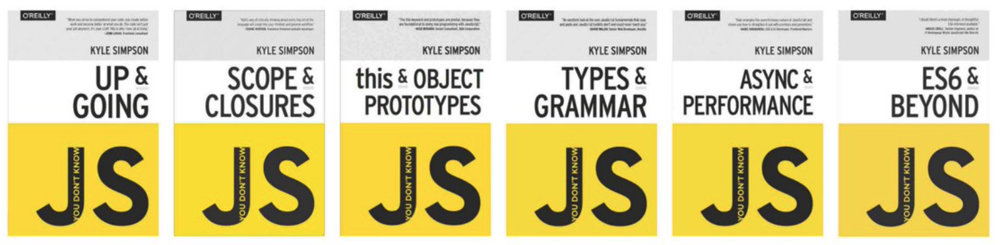

# Javascript

under constructions...

## \[Notes\]

## \[JavaScript is commonly used for\]

## \[How JS works and JS's iconic characteristics\]

## Recommended Resources \(and Learning Path\)

### 1\) \[Absolute beginner\] 



### 2\) \[Advanced concepts\] 

#### i\) Udemy video course - Advanced JS concepts



#### ii\) Books - You don't know JavaScript 6 books \(by Kyle Simpson\)

### 3\) \[Practice\] 



