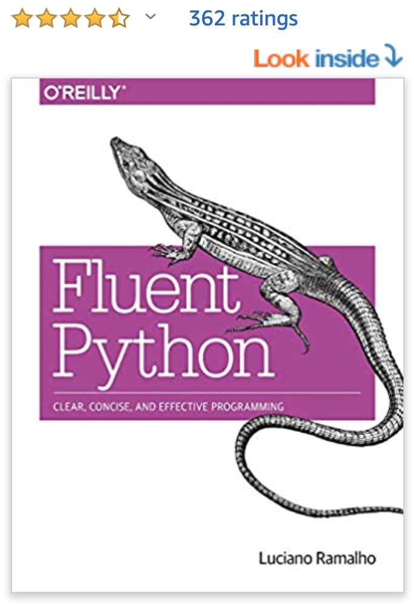

# Python

### \[Notes\]

Beware there are two versions of Python - Python2 and Python3. 

Python2 is the older version of Python while Python3 is the newest at the moment. Their syntax is similar but if there is no specific reason to use Python2 \(eg to maintain legacy code\), learn Python3 directly is recommended. Python2 is old and going to be deprecated now. Many frameworks and tools no longer support Python2. In the future, Python code will all eventually be upgraded or directly written in Python3.

## Recommended Resources 

### \[If you are new to Python\]

1\) Codecademy Python courses

2\) Book: Python Crash Course, 2nd Edition: A Hands-On, Project-Based Introduction to Programming 

### \[If you know Python and want to upgrade your Python\]

### 2\) Book: Fluent Python: Clear, Concise, and Effective Programming 1st Edition



