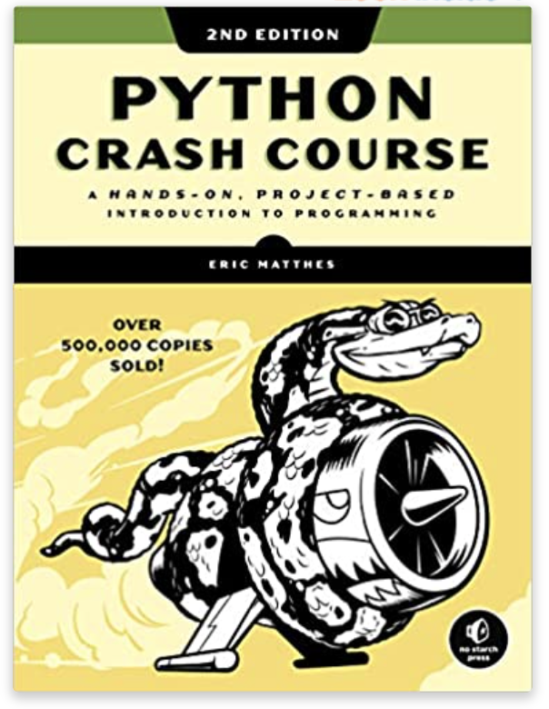

# Python

## \[Notes\]

Beware there are two main versions of Python - Python2 and Python3. 

Python2 is the older version of Python while Python3 is the newest at the moment. 

Their syntax is similar but **if you don't have a specific reason to use Python2** \(eg to maintain legacy code\), **learning Python3 directly is recommended**. Python2 is old and going to be deprecated now. Many frameworks and tools no longer support Python2. In the future, Python code will all eventually be upgraded to or be directly written in Python3.

## \[Python is commonly used for\]

### Scripting & Automation

\(under construction\)

### Application Development

* Web application 
  * Django Framework
  * Flask Framework

\(under construction\)

### Data Science

\(under construction\)

## \[How Python works and Python's characteristics\]

\(under construction\)

## Recommended Resources \(and Learning Path\)

### \[If you are new to Python\]

#### 1\) DIY - Codecademy \[Learn Python\] courses





#### 2\) \(Optional\) Book - Python Crash Course, 2nd Edition: A Hands-On, Project-Based Introduction to Programming \(2019\)



### \[\(Optional\) If you know Python and want to upgrade your Python\]

#### 3\) Book - Fluent Python: Clear, Concise, and Effective Programming 1st Edition \(2015\)



#### 4\) Book - Python Cookbook: Recipes for Mastering Python 3 \(2013\)

#### 5\) Book - Python 3 Object-Oriented Programming



### \[If you want to apply Python\]

#### 6\) Book & Udemy course - Automate the Boring Stuff with Python, 2nd Edition: Practical Programming for Total Beginners \(2019\)



#### 7\) Book - Python for Data Analysis: Data Wrangling with Pandas, NumPy, and IPython 2nd Edition \(2017\)



2020-10-6

