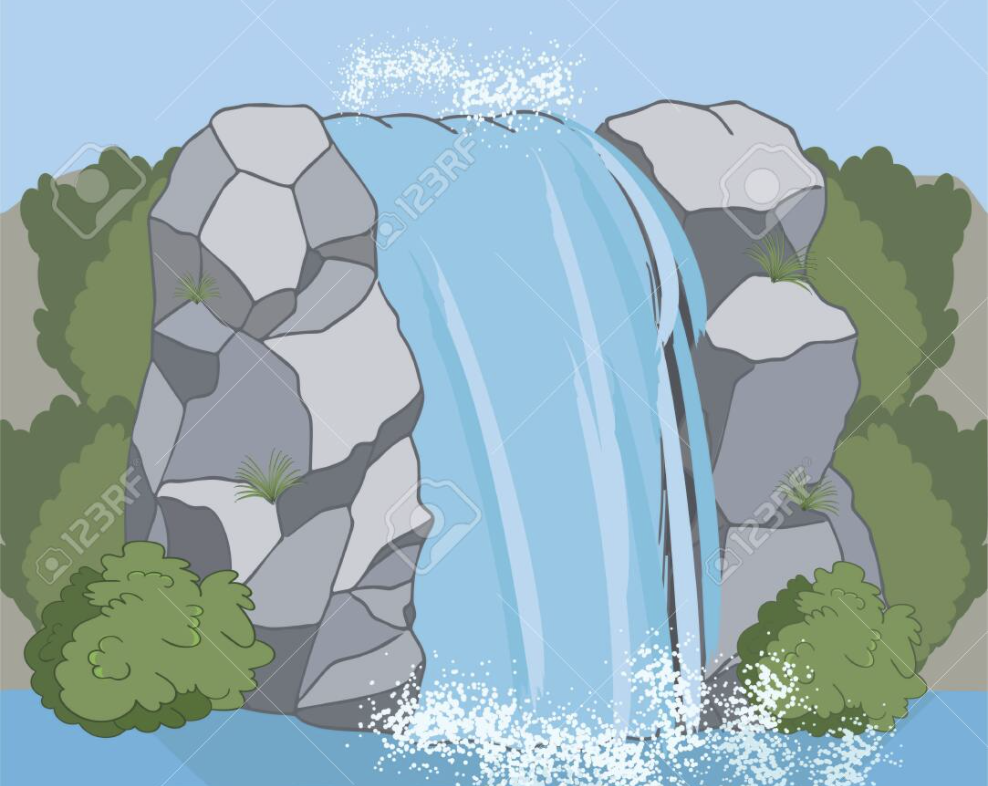
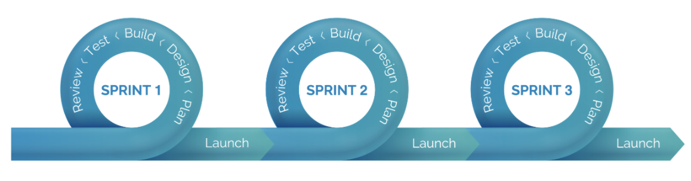

# Agile vs Waterfall

2020-10-4

Waterfall and Agile are actually two choices of product development approach \(or more accurately, product development mindset\). Broadly saying, apart from the software development process, they can also be used in any other scenes that involve a product's development. 

#### In this article, I will only focus on their usage in software development scenarios.

**In software development, Agile and Waterfall are actually not two choices.** Agile is actually a new improved way appearing aiming to replace Waterfall and tackle the old way's deficiencies. It is because Waterfall lacks flexibility and no longer fits the current digital era's rapidly changing environment.  

**Bear in mind that Agile and Waterfall are actually sets of values and principles \("mindsets", in a simple word\).** They are more like "interfaces" in Java. And then you, the team, decides how to "implement" either one of them into your project, according to your own project's situations. After all the ultimate goal is to make the software development process smooth and effective.

## Waterfall

**\[An extreme case of Waterfall\]** Your team got a job from the customer to make a rocket. You guys get the design graph from the client. You guys start building the rocket. After 20 years, the rocket is done. You hand in the Rocket to the client thus the delivery is finished and the job is completed. You do not have much communication with the client during the development process. The client basically will only see the rocket after 20 years when he gets the product delivered.

**\[Pros\]** 

Less time and effort needed for meetings, discussions, and re-planning because everything is pretty clear.

**\[Cons\]**

Risky if at the end the product is not what the client wants, then the 20 years are wasted. Lack of flexibility if the client often changes the requirements.

**\[When to use\]**

When a product requirement is static and super clearly concrete. The team and the customer know clearly and concretely what they will be making and how the product will be like at the end. I cannot think of a concrete software development scenario that Waterfall works better than Agile. Please tell me if you can think of one :p Thanks:p

## Agile





#### \[Core spirit\] 

Agile is a set of core principles and values. Continuous delivery. Fast iteration. Making the development process more like many loops rather than a single waterfall.

#### **\[Pros\]** 

Very flexible. Our era is not the world 50 years ago anymore. It is an IT era in which the business environment changes rapidly. The applications, as known as the solutions to solve the business problems, have to be agile enough to adapt to the rapid changes to meet the business needs. So that's why I am a strong advocator for Agile in the current era.

#### **\[Cons\]** 

Not many cons. Just if the team lacks Agile experiences, it may get trapped by overly following the forms advocated by Agile but forgot Agile is actually more a mindset or a spirit. 

For example, unnecessary meetings and over-short springs will slow down the development process. 

The team has to spend extra effort to keep adjusting the way they adopt Agile until Agile can run smoothly in the project, according to the situations \(eg their product and team size and deadline\), in order to achieve Agile's maximum power.

#### **\[When to use\]** 

So far I have never worked in a commercial software development project that is not adopting Agile. From my observations, I guess it has become the trend now. 

### My Agile experiences:

will add more content...

### List of great Agile Tools

**\[Kanban board tools\]**

**Trello** - Free Kanban board tool. I not only use it for sprinting but also organize my personal schedules and take notes.

**Jira** - A tool that includes the kanban board functions similar to Trello's but it is not free and much more powerful. It provides a full set of tools for you to work with Agile. You are very likely using it in a large project in a big team.

## Additional readings: 

#### 1\) Waterfall **vs** Agile in details



#### 2\) The history from Waterfall to Agile



## In the next chapter, we will take a look at testing methodologies that are most widely used in the industry. 

#### Bear in mind the word TDD, Test-Driven Development. 

#### It is a super important term in modern software development. It works well with Agile and I personally think it is the best \(if not the only\) way to be adopted by developers while developing software, in order to ensure the application is doing the right things and doing the things right. Every developer should know TDD. Let's go~

