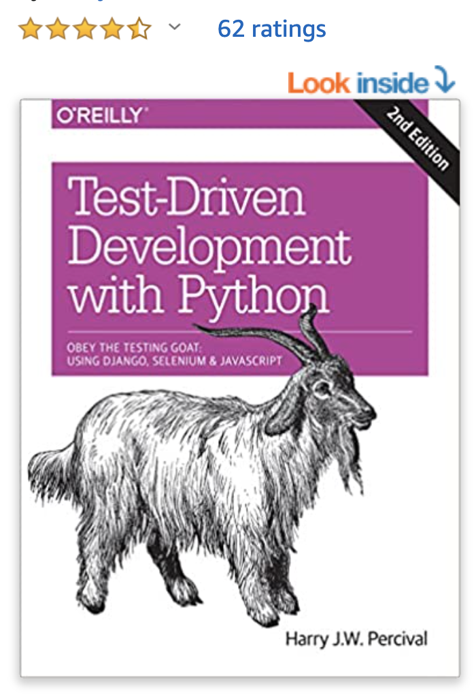
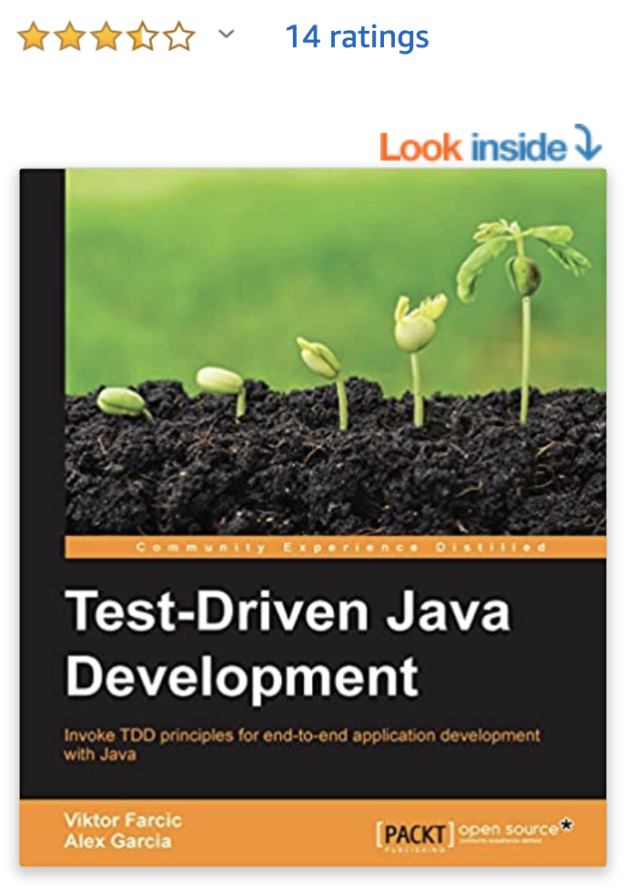

# TDD

**TDD can be a book's content. This passage is just a precise introduction for you to understand TDD's core. If you want to understand it deeper, the best way is still referring to authoritative industry resources \(eg classic books\), plus practicing in real projects with our own hands. Good luck :\)**

## **\[Core stakeholders in concern\]** 

Programmers \(or say, Developers\)

## **\[Core spirit\]** 

**Write tests before writing code.** 

TDD is a **process to write code** through **a short and repeated cycle** called Red-green-refactor.

## \[Execution\] 

### **\[**Step1\] Red → \[Step2\] Green → \[Step3\] Refactor

**1-1\) Write tests** - List out the expected behaviors of code, in a format of test cases.

**1-2\) Run all tests** - Should be100% failing \(i.e red\) because there is not yet any implementation code.

**2-1\) Write the implementation code** - Make the code work \(i.e. Write only enough code to fulfill the expected behaviors listed in step 1\)

**2-2\) Run all tests** - Should be 100% passing \(i.e. green\) at this time point, to ensure code is doing the right things.

**3-1\) Refactor code** - Make the code elegant \(i.e. maintainable, readable, etc\). 

**3-2\) Run all tests** - Should be 100% passing \(i.e. green\) at this time point, to ensure 3-1 did not break anything completed in 2-1.

**=&gt; TDD is implemented by repeating this cycle until the development of the application is done and ready for deployment.**

\*\*\*\*

## **\[Goals and Advantages of TDD\]**

**\*\*\* Note that a prerequisite of maximizing TDD's power is high code coverage. Ideally 100% code coverage if possible.**

**1\) Always up-to-date Documentation** - Save effort writing extra documentation

Tests in TDD become Executable Documentation. 

During traditional development, we often write documentation like a diary to give additional information about our code \(e.g what is the purpose of some code methods\) for future record-trace. The problem is that developers often need extra effort to maintain the documentation because documentation will inevitably get out-dated once there is any update in the code. Documentation is not reliable if no one is actively maintaining it.

With TDD we can solve this problem because the tests themselves become real-time documentation. No documentation can provide information that is as up-to-date and accurate as of the codebase itself \(the tests are a part of the codebase\). 

**2\) Increase Code Quality**

TDD forces you to organize your thoughts before writing any code. Your code becomes better structured when you write it out.

**3\) Easy to Debug or even NO Debugging**

If you do 100% code coverage. Every time after you add some code, you run the tests to check if there is anything broken. If yes, the bug must happen somewhere between the current code and the last version of code \(since the last version got 100% passing\). Therefore, with high code coverage, spotting bug is much faster through tests than debugging line by line from scratch. 

**4\) Increase Development Speed**

You can develop at great speed without worrying something will be broken.

## \[Ending Notes\]

I have tried TDD in development. The experience is refreshing and I frankly like the spirit promoted by TDD. 

Of course, there are some restrictions of TDD that if the team has no experience with it, 

I believe in the future, with more development teams trying TDD and having more experiences on it, TDD will become the main trend or even a must for any development teams that want to develop quality software in a tight deadline.

## Recommended Quality Resources:

### 1\) Test-Driven Development with Python: Obey the Testing Goat: Using Django, Selenium, and JavaScript 2nd Edition \(2017\)

[https://amzn.to/2GtntsJ](https://amzn.to/2GtntsJ)

### 2\) Test-Driven Java Development 1st Edition \(2015\)

[https://amzn.to/3iBiwLw](https://amzn.to/3iBiwLw)

2020-10-5

