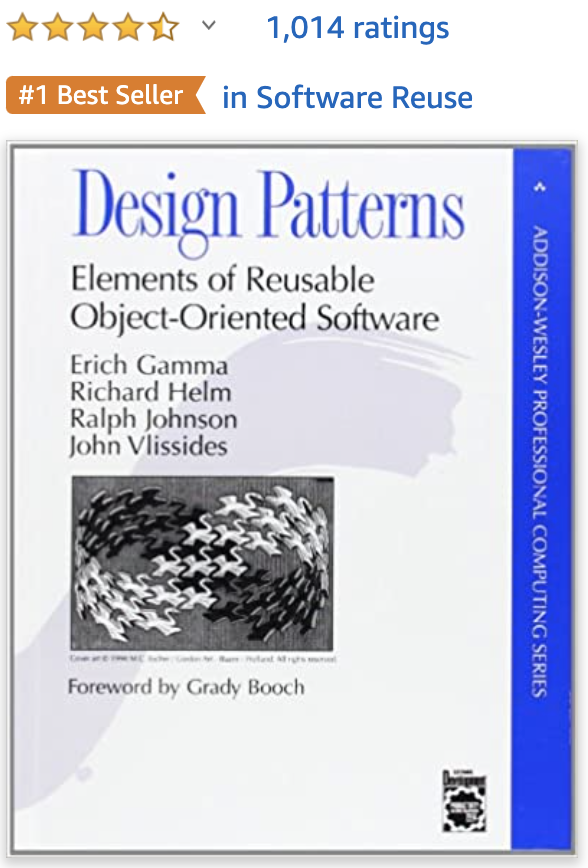
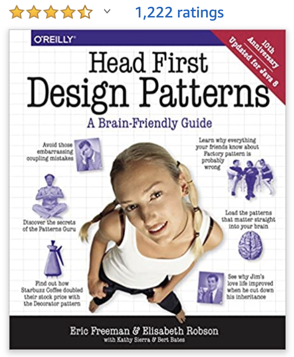

# 23 Design Patterns by GoF

### Design Patterns are all just concepts instead of concrete code. The 23 are just the famous ones. You can also create your own design patterns. Bear in mind that a good design pattern should follow ["OOD 5 principles"](https://app.gitbook.com/@christypacc21/s/developer-notes/~/drafts/-MJ2JJLBPtbseYFcHN7t/professional-software-engineer/writing-clean-code/code-architecture/ood-5-principles).

According to "The 80-20 rule", roughly 80% of the effects come from 20% of the causes. Therefore, actually, you don't need to use all of the design patterns in order to make the code good. Instead, just pick the most suitable ones for your projects.

## 1\) \[The Original Book\] Design Patterns: Elements of Reusable Object-Oriented Software [\(1st Edition\)](https://amzn.to/3iC0oBe)

## 2\) \[Beginner-friendly Book\] Head First Design Patterns: A Brain-Friendly Guide [\(1st Edition\)](%20https://amzn.to/3d3MDtS)

