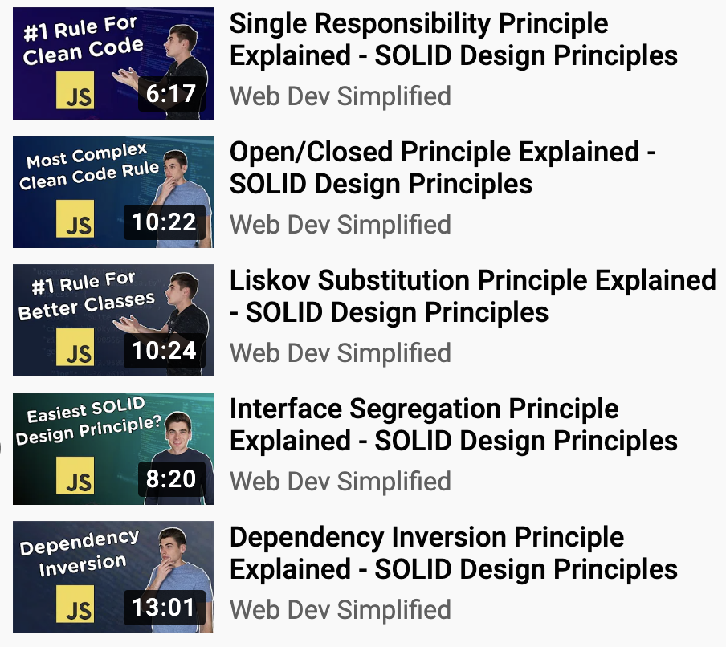

# OOD 5 Principles \(SOLID\)

#### Good OOD makes your code neat, precise, readable, robust, extendable, flexible, and maintainable. 

#### Your team will be happier to work with you. 

#### Also, the code becomes agile enough to enable Agile \([what is Agile?](https://christypacc21.gitbook.io/developer-notes/professional-software-engineer/software-development-process/agile-vs-waterfall)\) to run smoothly in your project.

If you use scripting languages like Python and JavaScript, instead of OOP languages like Java and C++, the concepts may be quite abstract for you to understand deeply. It is fine, just try to understand the broad view first.

### 

## \[Concept\] 

#### 1\) Single Responsibility Principle 

A class should only have a single responsibility, that is, only changes to one part of the software's specification should be able to affect the specification of the class.

#### 2\) Open/Closed Principle

Software entities should be open for extension but closed for modification

#### 3\) Liskov Substitution Principle

Objects in a program should be replaceable with instances of their subtypes without altering the correctness of that program.

#### 4\) Interface Segregation Principle

Many client-specific interfaces are better than one general-purpose interface.

#### 5\) Dependency Inversion Principle

One should depend upon abstractions, not concretions.

## \[Code : OOD 5 Principles in JavaScript\]

### I found [this series](https://www.youtube.com/watch?v=UQqY3_6Epbg&list=PLZlA0Gpn_vH_CthENcPCM0Dww6a5XYC7f&index=7) by [Web Dev Simplified](https://www.youtube.com/channel/UCFbNIlppjAuEX4znoulh0Cw) clear

